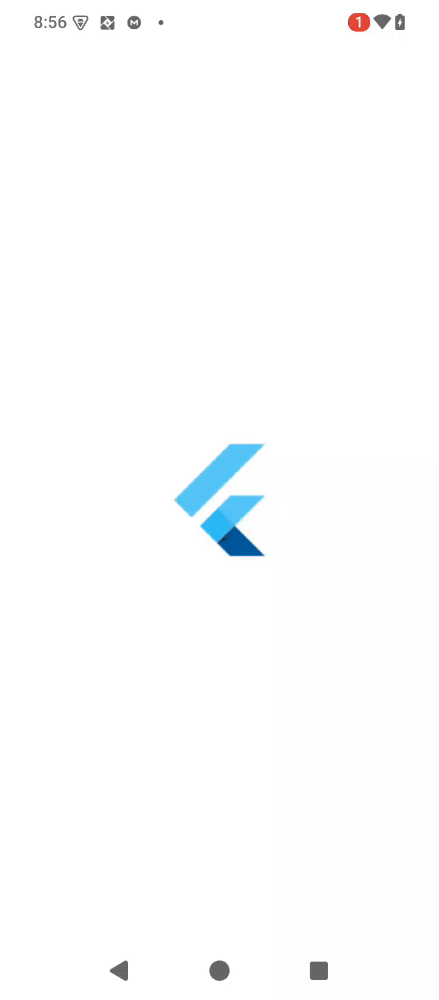
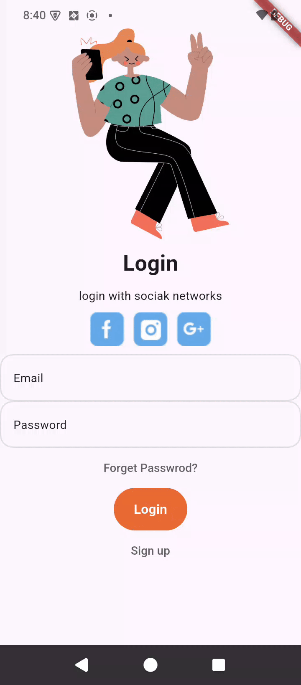
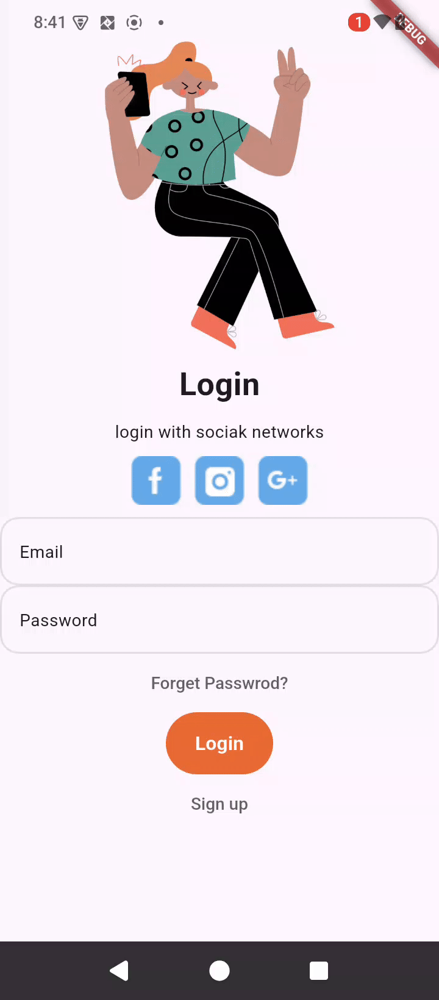

# 📚 Learning App UI 🎓📱

A Flutter-based **Learning App UI** that allows users to sign up, log in, and explore available courses.  
The focus of this project is to design a clean and engaging **user interface** for an e-learning application.

---

## 📘 Features Implemented

- ✅ **Splash Screen** – Displays the app logo when starting the app.  
- ✅ **Login & Sign-Up Screens** – Users can register or log in to the app.  
- ✅ **Home Screen** – Shows basic user information and available courses.  

⚠️ **Note**: The **Course Details Screen** is not yet implemented.

---

## 📂 Project Structure

```
lib/
┣ module/
┃ ┣ current_user.dart
┃ ┗ users.dart
┣ screens/
┃ ┣ home_screen.dart
┃ ┣ login_screen.dart
┃ ┣ signup_screen.dart
┃ ┗ splash_screen.dart
┣ widgets/
┃ ┗ course_card.dart
┗ main.dart
```

- **assets/img/** → Stores images and icons used in the app.  
- **lib/screens/** → Contains all main app screens.  
- **lib/widgets/** → Reusable UI components (e.g., course cards).  
- **lib/module/** → User-related data and models.  

---

## 🎨 UI Reference

This project is inspired by the following Figma design:  
👉 [Course EdTech Mobile App (Figma)](https://www.figma.com/design/xlEI4XXk7ZRzTRxfLc46fE/Course-EdTech-Mobile-App-(Community)?node-id=0-1&p=f&t=FgLZdcCvSivg3qjR-0)

---

## ⚙️ Setup Instructions

1. Clone the repository:
   ```bash
   git clone https://github.com/Camp-management/learning-app-73azn.git

   cd learning_app_73azn

   flutter run

## 📸 Screenshots and videos

### splash screen


### page view screen


### login screen


### sign up screen
